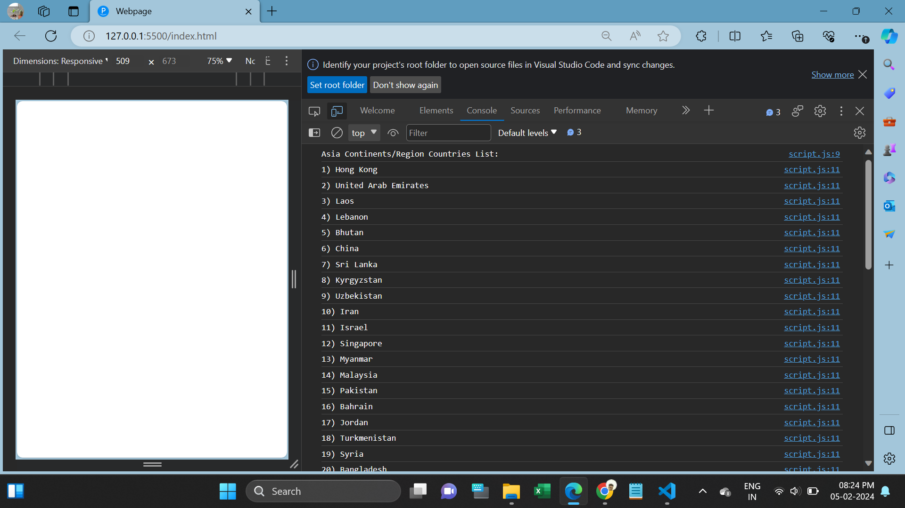
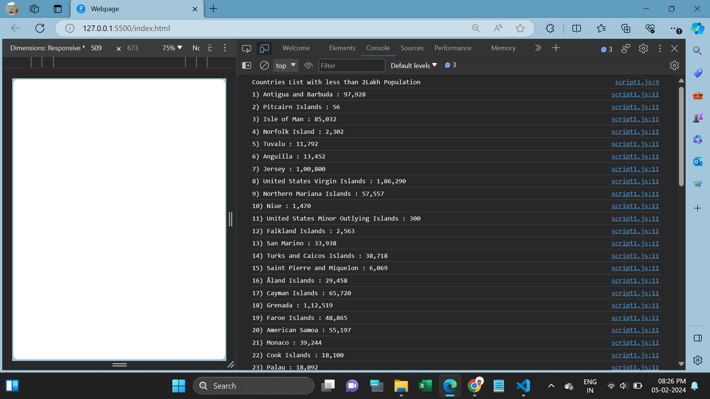
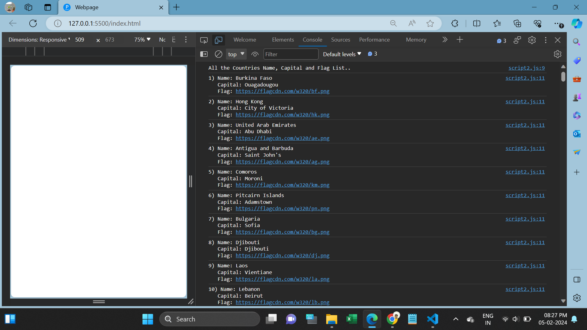
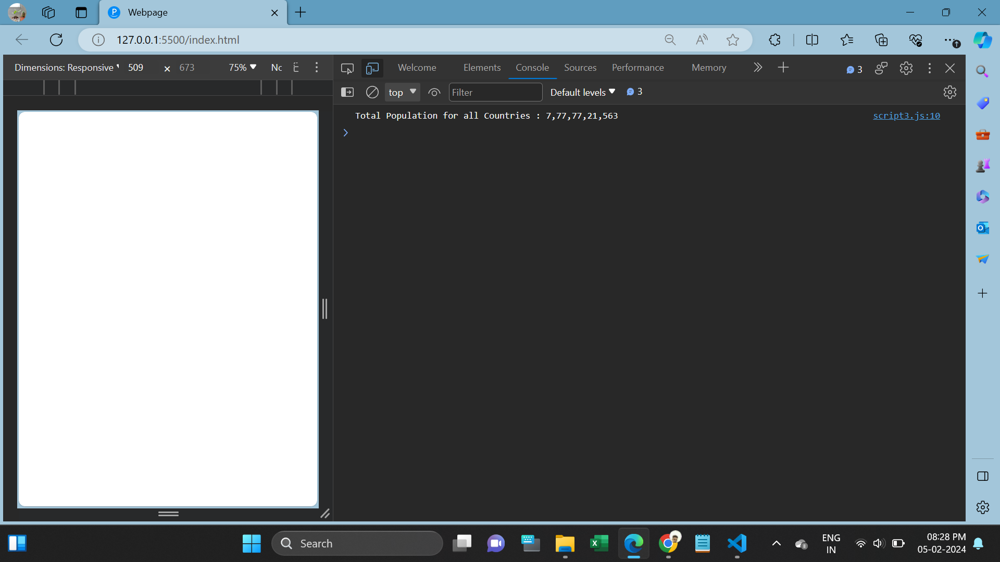
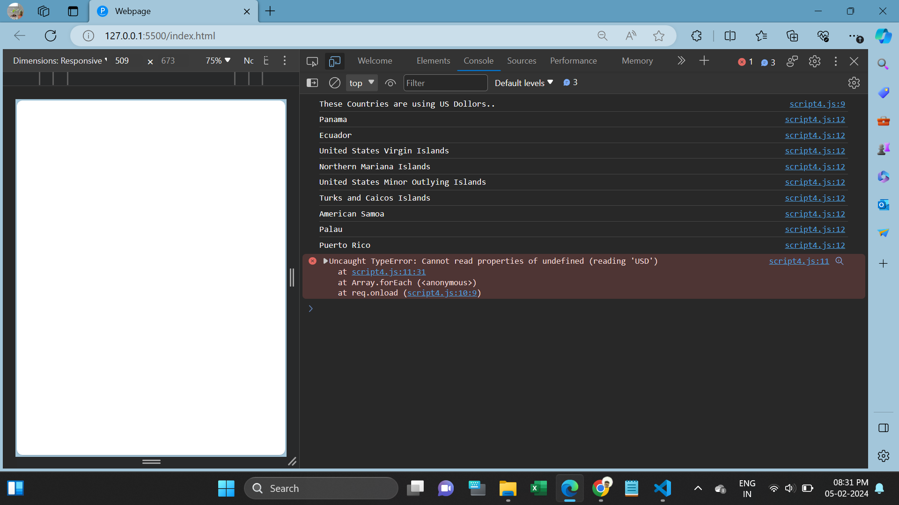

<h1>Array Methods Task</h1>

1. Solving problems using array functions on rest countries data (https://restcountries.com/v3.1/all).

a) Get all the countries from Asia continent /region using Filter function.

 => I used filter and map method to get countries from Asia continent/region through API.

 

b) Get all the countries with a population of less than 2 lakhs using Filter function.

 => I used filter and map method to get countries with less than 2Lakh population.

 

c) Print the following details name, capital, flag, using forEach function.

 => I used forEach method to iterate Country name, capital, flag.

 

d) Print the total population of countries using reduce function.

 => I used reduce method to calculate all the countries population.

 

e) Print the country that uses US dollars as currency.

 => I used to forEach method to print which countries are using US dollar currency.

 

I have attached all the Output Screenshots in below:

 
<h2>map():</h2>

map() creates a new array from calling a function for every array element.

<h2>filter():</h2>

The filter() method creates a new array filled with elements that pass a test provided by a function.

<h2>reduce():</h2>

The reduce() method executes a reducer function for array element
and it returns a single value: the function's accumulated result.

  
<h2>Screenshots</h2>

Script.js

Script1.js

Script2.js

Script3.js

Script4.js

